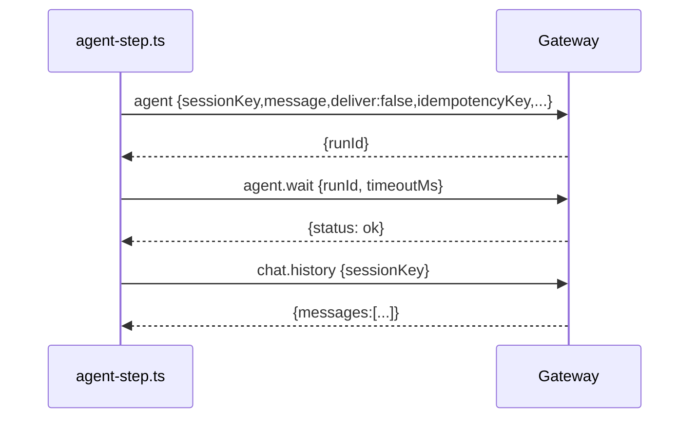

# Agents 走读（Deep Dive）

> 代码位置：`/root/github/openclaw/src/agents/*`

## 1. Agents 的定位

Agent 负责把“输入（消息/事件）”变成“输出（回复/工具调用/动作）”。

在 OpenClaw 的架构里，Agent 并不是一个独立进程，而是由 Gateway 调度的运行时组件。

从目录可以看到 agent 层承担了很多职责：

- 模型调用与 provider 适配（auth profiles、failover、payload log）
- 上下文管理（compaction、context window guard）
- 工具调用（bash-tools、process、channel-tools、sessions-send-tool 等）
- 嵌入式 runner（pi-embedded-runner）与 ACP 相关对接

## 2. 一个可观察的“最小 agent step”：`runAgentStep`

`src/agents/tools/agent-step.ts` 提供了一个很直观的“代理调用示例”（用于 sessions_send 等场景）：

1. 通过 Gateway RPC 调用 `agent` 方法：
   - `deliver: false`（不投递到外部渠道）
   - 传入 `sessionKey/message/extraSystemPrompt` 等
   - 带 `idempotencyKey`
   - 带 `inputProvenance`（跨 session 的来源标记）
2. 再调用 `agent.wait` 等待完成
3. 然后通过 `chat.history` 拉取历史，找到最后一条 assistant 文本回复

这说明：

- **Agent 的运行是 Gateway 方法调用驱动的**（`method: "agent" / "agent.wait"`）
- runId/idempotencyKey 是串联一次运行的重要标识
- 历史记录也是通过 Gateway 统一访问（`chat.history`）

（简化）时序图：

## 3. 上下文窗口与模型元信息（`src/agents/context.ts`）

`context.ts` 展示了一个工程化细节：

- 会懒加载 pi-coding-agent 的 models metadata
- 从 config 与 discovered models 合并 contextWindow
- 对 Anthropic 1M 上下文模型做特殊处理（`context1m` + prefix 检测）

这说明 agent 层在做 token budgeting/上下文管理时，需要尽可能准确的模型限制信息。

## 4. 与 Gateway 的关系

Gateway 会：

- 在 `server.impl.ts` 中通过 `onAgentEvent(...)` 订阅 agent 事件，并广播给 WS clients
- 通过 sessionKey/runId 把 agent 的运行状态与对话历史绑定

更具体的 agent loop / tool streaming 细节，需要继续走读：

- `src/gateway/server-chat.ts`（agent events handler）
- `src/gateway/server-methods.ts`/`server-methods/*`（agent 方法的实现）
- `src/agents/pi-embedded-runner/*`（嵌入式运行器）

