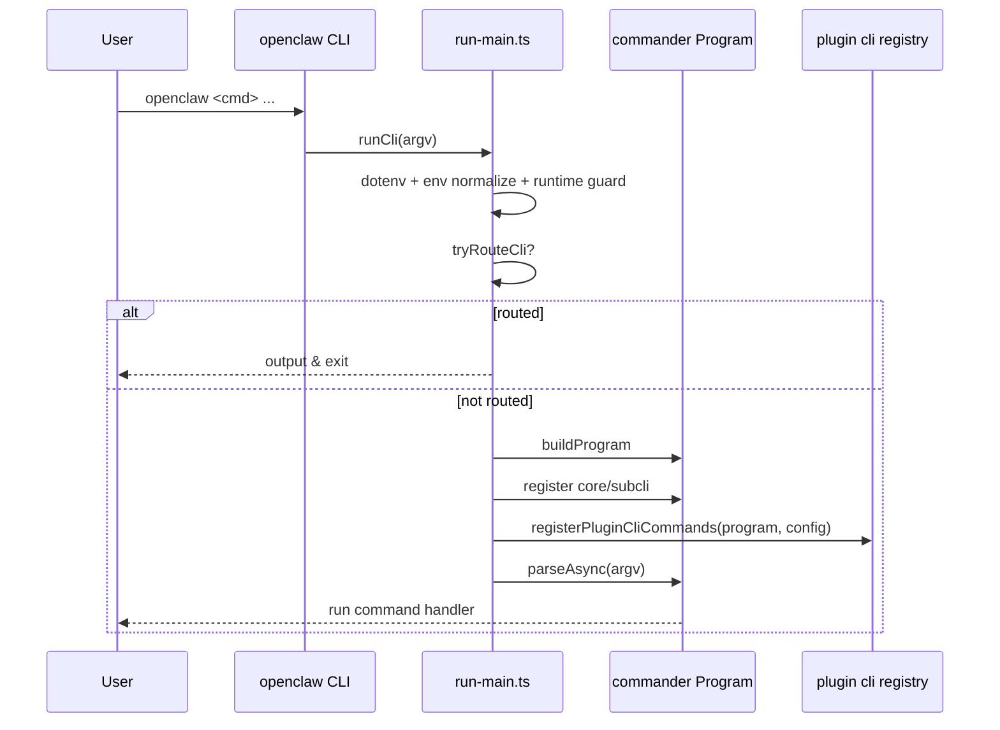
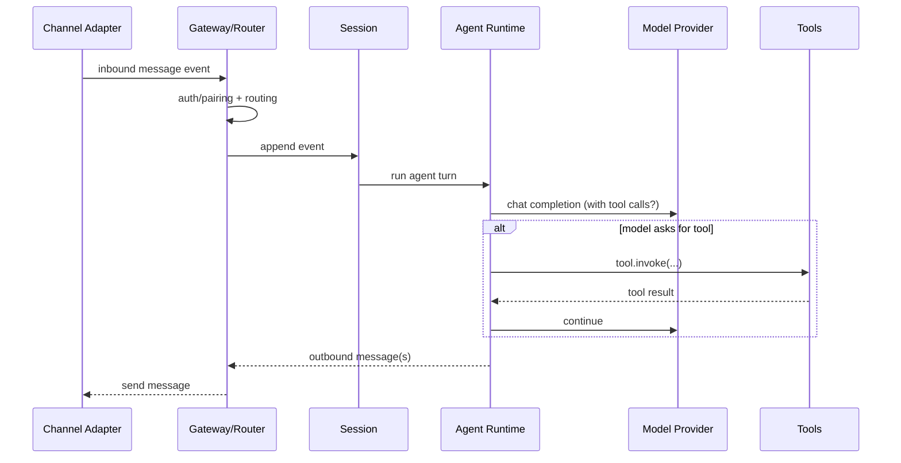

# 4. 项目的主要流程（Major Flows）

本节回答：从“收到一条消息”到“回复/执行工具”的核心流程是什么；从“启动 gateway”到“可用”的流程是什么。

## 4.1 CLI 执行流程（命令分发）

已确认入口链路（详见 [runtime-structure.md](./runtime-structure.md)）：

- `openclaw.mjs` → `dist/entry.js` → `src/entry.ts` → `src/cli/run-main.ts`
- `run-main.ts` 主要流程：
  1. `loadDotEnv` + `normalizeEnv`
  2. `assertSupportedRuntime`
  3. `tryRouteCli`（某些命令快速路径）
  4. `buildProgram()` 构建 commander
  5. 注册核心命令/子命令
  6. 按配置注册插件 CLI commands（`registerPluginCliCommands(program, loadConfig())`）
  7. `program.parseAsync(argv)` 执行



## 4.2 Gateway 启动与常驻流程（推断）

典型动作：`openclaw gateway ...` 或通过 daemon/systemd/launchd 常驻。

推断的运行步骤：

1. CLI 启动 gateway 子命令
2. gateway 初始化配置、日志、锁（避免重复启动）
3. 启动 WS/RPC 服务（默认 18789）
4. 加载 channels/extensions，根据配置连接外部服务（WhatsApp/Telegram/...）
5. 初始化 sessions/agents/tool registry
6. 对外提供：
   - 控制面（web/ui/ws）
   - 消息收发
   - 工具调用

```mermaid
flowchart TD
  A[openclaw gateway start] --> B[Load config + logging]
  B --> C[Acquire gateway lock / port]
  C --> D[Start WS/RPC server :18789]
  D --> E[Init tool registry\n(exec/browser/canvas/nodes/...)]
  E --> F[Load plugins/extensions]
  F --> G[Connect channels]
  G --> H[Ready: sessions + agents + web surfaces]
```

## 4.3 入站消息处理（Channel → Session/Agent → Reply）

从 README 的描述与目录结构，核心链路通常是：

- Channel adapter 收到消息事件
- Gateway/Router 判断：
  - 来自哪个 channel/account/peer
  - 是否允许（pairing/allowlist）
  - 应该路由到哪个 agent/session（main / group isolated / per-channel agent）
- Session/Agent 运行：
  - 组装上下文（历史消息、记忆检索）
  - 调用模型（支持 failover）
  - 产生输出：回复文本/媒体，或调用工具
- 回复通过 channel adapter 发回



## 4.4 工具调用流程（Tools）

OpenClaw 的工具形态非常“系统化”，在代码里对应 tool registry/权限系统：

- 浏览器：`src/browser/`
- Canvas：`src/canvas-host/`
- Nodes：`src/node-host/`（以及 nodes CLI / 协议）
- Cron：`src/cron/`

工具调用一般是：Agent 发起 → Gateway 执行/权限校验 → 返回结果 → Agent 继续。

## 4.5 你可以从哪里开始“深入读代码”

如果你的目标是理解“主要流程”，建议按顺序读：

1. CLI 总入口：`src/entry.ts`、`src/cli/run-main.ts`
2. 命令注册：`src/cli/program/*`、`src/cli/program.ts`
3. Gateway 内核：`src/gateway/*`
4. Session/Agent：`src/sessions/*`、`src/agents/*`
5. Channel 抽象与一个具体渠道实现（比如 `extensions/telegram` + `src/channels/*`）
