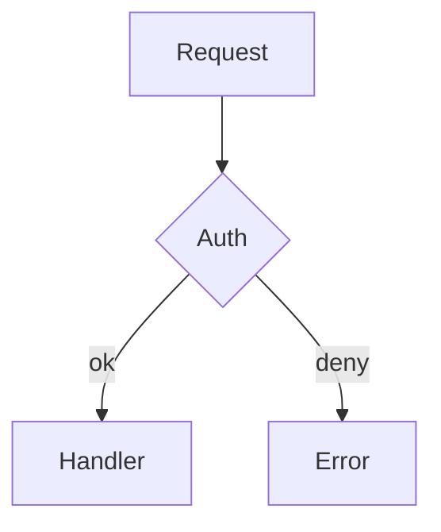

这是一篇用于测试渲染能力的文章。

## Mermaid

```mermaid
flowchart TD
  A[Request] --> B{Auth}
  B -->|ok| C[Handler]
  B -->|deny| D[Error]
```

## LaTeX

行内公式：$E=mc^2$。

块级公式：

$$
\nabla_\theta \; \mathcal{L}(\theta) = \frac{1}{N} \sum_{i=1}^{N} \nabla_\theta \; \ell_i(\theta)
$$
